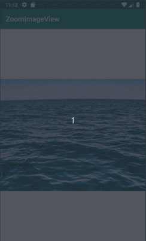
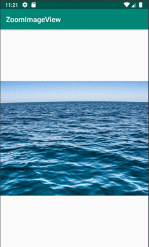

# ZoomImageView
Extended ImageView with animated zooming, pinching and scrolling.

So there is **ZoomImageView**.



And also lib got **ZoomImagePager** to use in pair with **ZoomImageView** to implement scroll gallery.



## How to use it

Through the xml:

```
  <!-- all `app:` attributes are set in default values -->
    <com.bugdim88.zoomimage.ZoomImageView
        android:layout_width="match_parent"
        android:layout_height="match_parent"
        app:animateOnReset="true"
        app:autoCenter="true"
        app:doubleTapScaleFactor="2f"
        app:doubleTapZoom="true"
        app:maxScale="8f"
        app:minScale="0.6f"
        app:restrictBounds="true"
        app:scrollable="true"
        app:zoomable="true" />
```

All "app:" values may be changed in code respectively.

Use **ZoomImagePager** as simple ViewPager with **ZoomImageView** as child view.

### Gradle updates

```
allprojects {
		repositories {
			...
			maven { url 'https://www.jitpack.io' }
		}
	}
  ```
  
 ```
 dependencies {
	        implementation 'com.github.bugDim88:ZoomImageView:$last_release_number'
	}
  ```
